# Web

## CSS layout

> 웹 페이지에 포함되는 요소들을 취합하고 그것들이 어느 위치에 놓일 것인지 제어하는 기술

- display, position,` float`, `flexbox`, `grid` .. etc

## float

- float된 이미지 좌, 우측 주변으로 텍스트를 둘러싸는 레이아웃을 위해 도입
- 이미지가 아닌 다른 요소들에도 적용해 웹 사이트의 전체 레이아웃을 만드는데까지 발전
- 기본값 : none
- `left` 요소를 왼쪽으로 띄움, `right` 오른쪽으로 띄움 ( 우리 얼굴방향으로 띄운다고 생각하면 됨)
- 
- 

```html
<style>
    .left {
      /* 위로 띄워지면서 글자들이 감싸게됨 */
      float: left;
	}
</style>
```

- (참고) 그냥 단어 더미들을 만들고 싶을 때 body에 `lorem` 쓰면 됨

```html
<body>
  <div class="box left">float left</div>
  <p>
    Lorem ipsum dolor sit amet consectetur adipisicing elit. Architecto alias et blanditiis assumenda odio facere distinctio deleniti similique, modi est possimus eum perferendis debitis earum consectetur dolore facilis magnam iure eligendi suscipit, numquam quasi, voluptatem omnis explicabo. Laboriosam voluptatibus sequi laborum nam perspiciatis architecto, iste dolore doloremque consequuntur doloribus maxime ea facere non ut ipsam eum consectetur provident recusandae eveniet sapiente. Tenetur commodi, quas unde voluptate vitae dolorem iusto repellendus id, debitis, dolor eaque doloribus beatae ducimus. Quis deserunt omnis nobis ratione optio expedita cupiditate repellendus cumque odio vero obcaecati amet illo rem assumenda ut iusto voluptate, laboriosam et vel?
  </p>
</body>

```

-  floatleft로 띄워져 있는 거당


####  floatclear 방법

- float를 했을 때 위로 떠서(집나간 자식, 부모의 높이 이런거 다 무시함) 그 아래공간으로 다른 요소들이 치고 들어가 겹쳐질 수 있음
- 해결하려면 여러 방법이 있지만
- 가장 정석 float로 띄운 것 뒤에 가상의 박스를 둔다고 생각하면 됨
- float는 인라인 요소, 텍스트 요소를 감싸는 것, 그래서 그렇지 않은 것들이 겹쳐 질 수 있음

- 가상 높이를 만들어 부모가 만든 높이를 만들어줌

1. 항상 float속성을 적용한 요소의 부모 요소에 적용함 

2. 보통 이런 현상을 해결하기 위한 스타일 이름은`.clearfix`라고지음 

3. `header `태그 다음에 가상요소(`::after`)로 내용이 빈 블럭을 만들고 

4. 이 가상요소는 `float left, right(both)`를 초기화 한다(무시한다=띄운거를 무시함)
5. 내용이 빈 컨택트를 만듦
   - (참고)content에 단어를 적는다면 content하나하나의 뒤에 들어감
6.  다른요소가 올라오지 못하게 블락으로 설정
7. 오른쪽 왼쪽 둘다 오지못하게 막음

```html
<style>
    .left {
      float: left;
    }
    .clearfix::after {
      content: "";
      display: block;
      clear: both;
    }
</style>
```

-  clearfix를 적용하면 파란박스가 올라가지못함, 위에 가상의 블락이 막고 있음 
- 처음엔 빨간박스가 띄워지면서 파란박스가 뒤로 깔림(그래서 `clearfix`설정)

```html
<body>
 
  <header class="clearfix">
    <div class="box1 left">div</div>
  </header>
  <div class="box2">div</div>
</body>
```


## flexbox(CSS flexible box layout)

- float는 flexbox나 grid 가 나오기 전에 나옴 
- 단순히 텍스트를 감싼다는 기본적 목적으로 주로 많이 쓰임
- 그 원인이 flexbox라는 기술이 나왔기 때문
- 요소 간 공간 배분과 정렬 기능을 위한 1차원(단방향)레이아웃
- 뷰포트나 요소의 크기가 불명확하거나 동적으로 변할 때 효율적으로 요소를 배치, 정렬, 분산할 수 있는 방법을 제공하는 레이아웃 방식
- 복잡한 계산 없이 요소의 크기와 순서를 유연하게 배치할 수 있음
- 정렬, 방향, 순서, 크기 등을 유연하게 조절할 수 있기 때문에 별도의 분기 처리를 줄일 수 있음
- 복수의 자식요소인 `flex item`과 그 상위 부모 요소인 `flex container`로 구성됨
- 반드시 알아야할 것! 요소, 축
- **요소**
  - flex container(부모 요소)
  - flex item(자식요소)
- **축**
  - main axis(메인축)
  - cross axis(교차축)


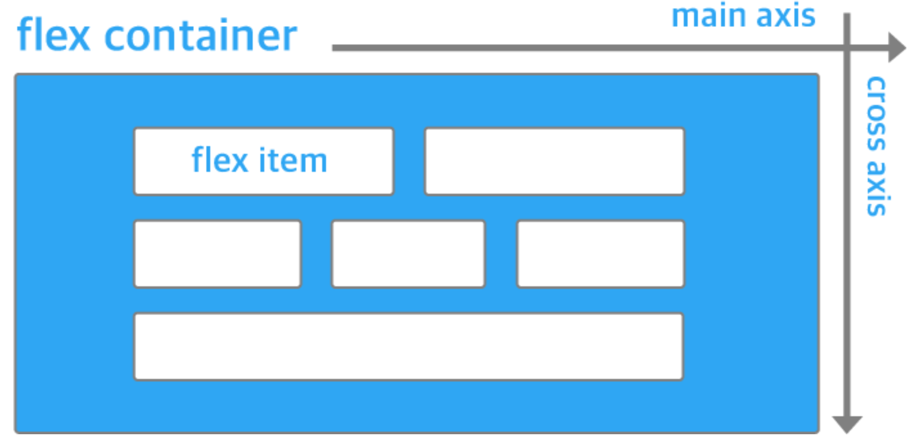

- 부모가 자식의 layout 설정을함
- 부모 요소에 display:flex  혹은 inline-flex를 작성
- flex는 부모 컨테이너는 그대로 block
- inlineflex를 주면 부모도 inline이 됨


##### 배치 방향 정렬

- flex-direction

##### 메인축 방향 정렬(justify가 붙으면 메인축)

- justify-content

##### 교차축 방향 정렬(align이 붙으면 교차축)

- alilgn-items, align-self, align-content


#### justify&align


**속성값 포인트를 외우기**

- content
  - 여러줄
  - justify는 content만 있음
- items
  - 한줄
- self 
  - 하나를 선택해서 움직임
  - flexitem개별 요소
- justify-content
  - 메인축 기준
  - 여러 줄 정렬
- align-items
  - 교차축 기준
  - 한 줄 정렬
- align-self 
  - 교차축 기준
  - 선택한 요소 하나 정렬

##### 기타

- flex-wrap, flex-flow, flex-grow, order

```html
/* 부모가 정한 너비를 넘치지 않게함, 넘으면 떨어뜨림 */
      flex-wrap: wrap;
```

- `flex-flow: column wrap;`

  - flex-direction과 flex-wrap의 약어

  - 부모가 정한 너비를 넘칠경우

    `flex-wrap:nowrap`이 기본값

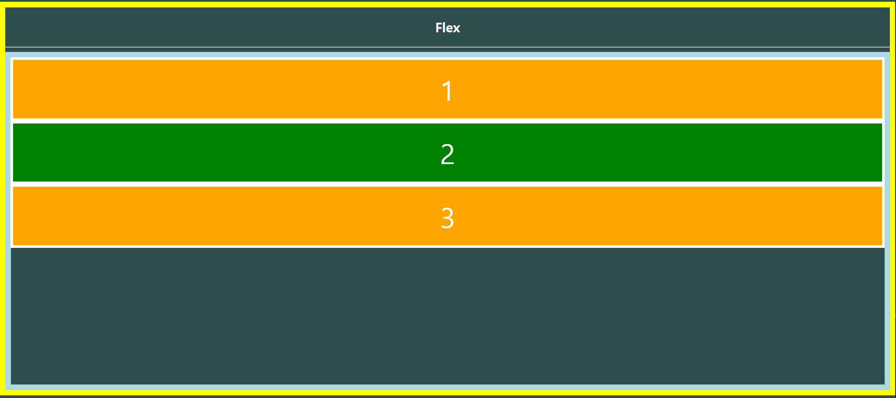

- flexgrow 
  - 1:2:3 아님
  - 남은 여백을 쪼개서 나눈거임 1+2+3 6으로 나눈것에서 1개를 주고 2개를 주고 3개를 줌
  - 상대적 비율이 아님
  - 남는 여백을 어떻게 분배할것인가, 누가한테 얼만큼? 음수는 사용할 수 없음
  - 1한테 전체 여백을 다 준것임

```html
<style>
    /* 한 자식한테 특정해서 self를 지정해줌 */
    .item1 {
        flex-grow: 1;
    }
    .item2 {   
        flex-grow: 2;
    }
    .item3 {
        flex-grow: 3;
    }
</style>
```

- `flex-grow: 1;`
  - 비율을 뜻하는게 아니라 flexgrow준것들을 다 더한것중 1개        
- `flex-grow: 2;`
  - 비율을 뜻하는게 아니라 flexgrow준것들을 다 더한것중 2개 
- `flex-grow: 3;` 
  - 비율을 뜻하는게 아니라 flexgrow준것들을 다 더한것중 3개

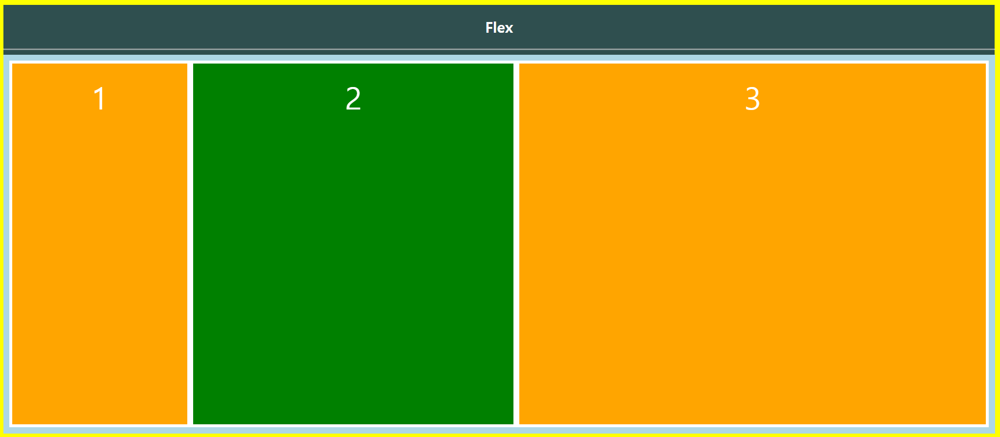


```html
<style>
	.item1 {
      order: 0;
    }
    .item2 {
      order: 1;
    }
    .item3 {
      order: -1;
    }
</style>
```

- `order: 0;` 
  - order기본값은 0 
- `order: 1;`
  - 만약 item1과 3이 0일때,
  - item2에 order1을 주면 제일 뒤로감
  - 그 이유는 1,3은 order가 0인데 2는 1이기 때문 
- `order: -1;`
  - 제일 앞으로 감

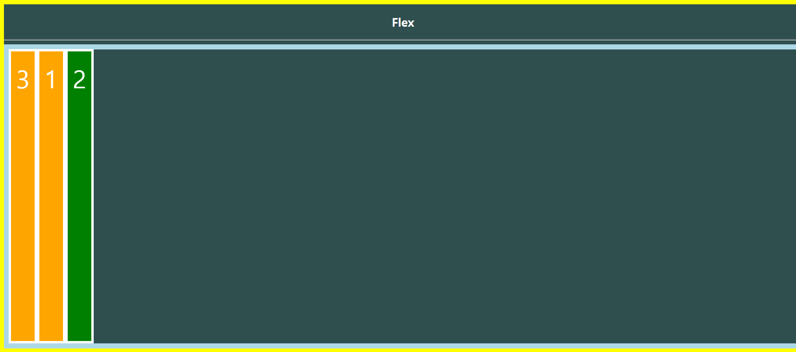


```html
<style>
.item1 {
      align-self: flex-start;
    }
    .item2 {
      align-self: center;
    }
    .item3 {
      align-self: stretch;
      align-self: flex-end;  
    }

</style>
```

- item 3`align-self: stretch;`
  - stretch는 item은 크로스축의 크기를 채우기위해 늘어남 

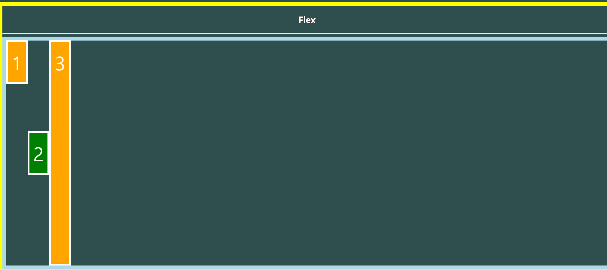

- item3 `align-self: flex-end;`


#### 예시

- 부모한테 display flex를 주기 전

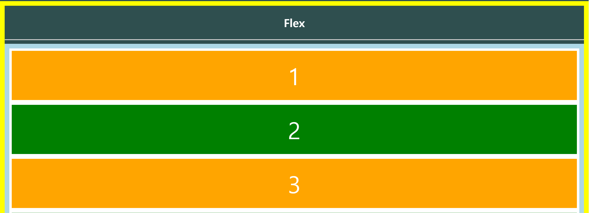

- 부모한테 display flex를 주고난 후
- 메인축 기준(row)으로 기본흐름이 왼쪽부터 오른쪽
- item은 주축에서 시작하고 높이를 따로 주지 않았지만 교차축기준으로 나머지 여백이 다 채워짐

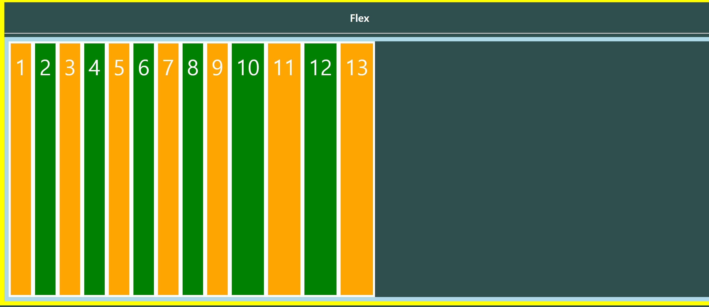


#### 부모 containe에 flex선언시

1. item은 행으로 나열된다
2. item은 메인축의 시작선에서 시작
3. item은 크로스축의 크기를 채우기 위해 늘어남


#### flex에 적용하는 속성

- 배치 방향 설정(메인축방향 변경 : 좌우 ->상하 상하->좌우 이런식으로 메인축의 수직이 교차축)

##### 배치 방향 정렬

- **flex-direction**
  - main-axis 방향만 바뀜 (크로스축은 그냥 수직!)
  - flexbox는 단방향 레이아웃이기 때문
  - 왼쪽->오른쪽이 기본값
  - row(default)
  - row-reverse는 반대
  - column은 메인축이 위에서 아래로 흐르는 형태로 바뀜
  - column-reverse 아래에서 위로

```html
<style>
      /* 부모한테 display flex를 주는 것이 시작 */
    .flex-container {
      display: flex;
/* 부모가 정한 너비를 넘치지 않게함, 넘으면 떨어뜨림 */
      flex-wrap: wrap;
      /* 기본값  row */
      flex-direction: row;
      /* 쌓이는 방향이 바뀜 321 */
      flex-direction: row-reverse;
      /* 메인이 y축으로 바뀜 */
      flex-direction: column;
      /* 아래에서 위로 쌓아 올라가는 모습 */
      flex-direction: column-reverse;
      /* flex-direction과 flex-wrap의 약어 */
      flex-flow: column wrap;
</style>
```

- 기본값 : `flex-direction: row;`

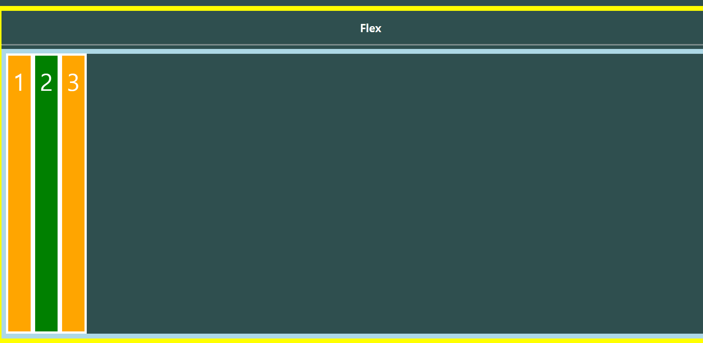

- `flex-direction: row-reverse;`
  - 쌓이는 방향이 바뀜 321


-  `flex-direction: column;`
  - 메인이 y축으로 바뀜 


- `flex-direction: column-reverse;`
  - 아래에서 위로 쌓아 올라가는 모습      

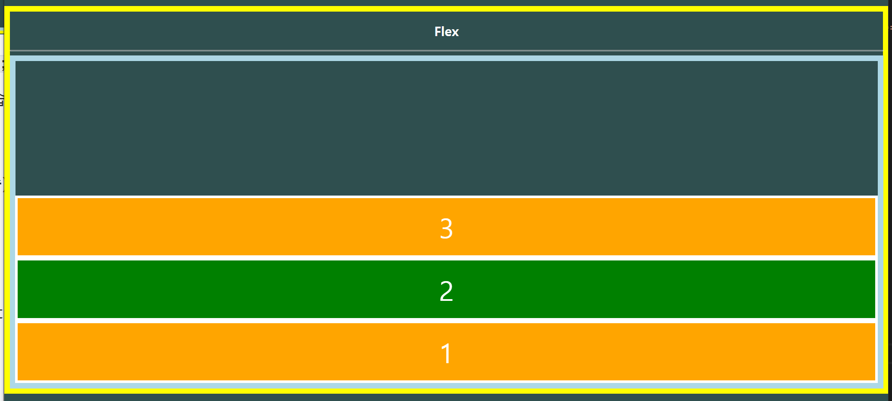


##### 메인축 방향 정렬(justify가 붙으면 메인축)

- justify-content

```html
<style>
	/* 정렬시작 */
    /* 메인축 정렬 */
    /* 이게 기본값 */
    justify-content: flex-start;
    /* 흐름의 방향은 바뀌지 않고 정렬만 바꼈기 때문에 순서는 그대로, 우측정렬됨 */
    justify-content: flex-end;
    /* 메인축 기준으로 가운데로 옴 */
    justify-content: center;
    /* 처음과 끝을 각 끝으로 보내고 가운데 것들을 균등하게 나눔 */
    justify-content: space-between;
    /* 균등 좌우 정렬 내부요소의 여백이 외부요소의 여백의 2배 */
    justify-content: space-around;
    /* 균등정렬 균등하게 띄워져 있음 내부요소 여백과 외부요소 여백이 같음*/
    justify-content: space-evenly;

</style>
```

- ` justify-content: flex-start;`
  - 이게 기본값 

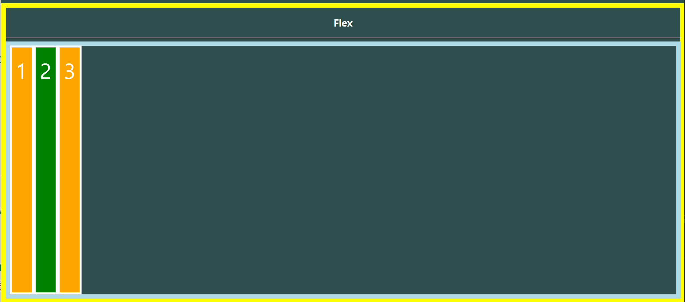

- `justify-content: flex-end;`
  - 흐름의 방향은 바뀌지 않고 정렬만 바뀜
  - 순서는 그대로, 우측정렬됨  

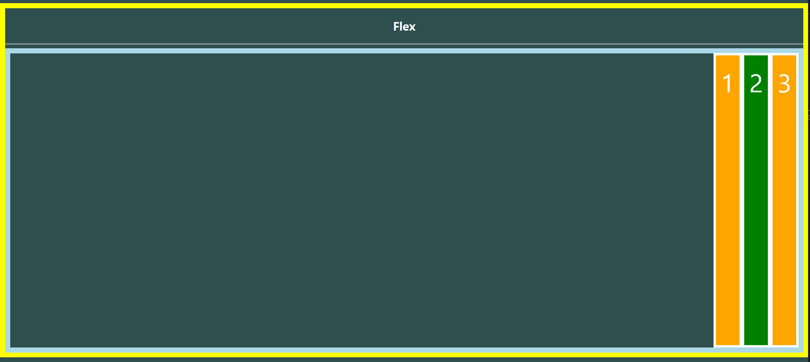

- `justify-content: center;`
  - 메인축 기준으로 가운데로 옴

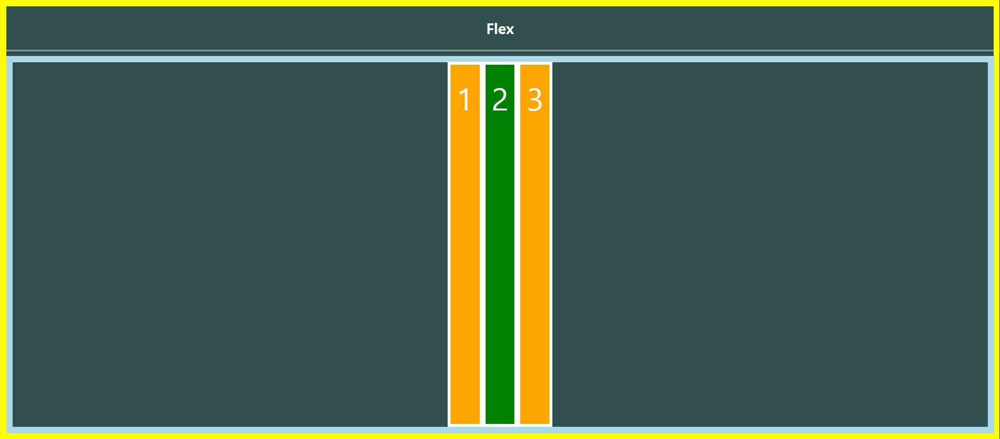

- ` justify-content: space-between;`
  - 처음과 끝을 각 끝으로 보내고 가운데 것들을 균등하게 나눔     


- `justify-content: space-around;`
  - 균등 좌우 정렬
  - 내부요소의 여백이 외부요소의 여백의 2배     
  - 여백 1:2:2:1

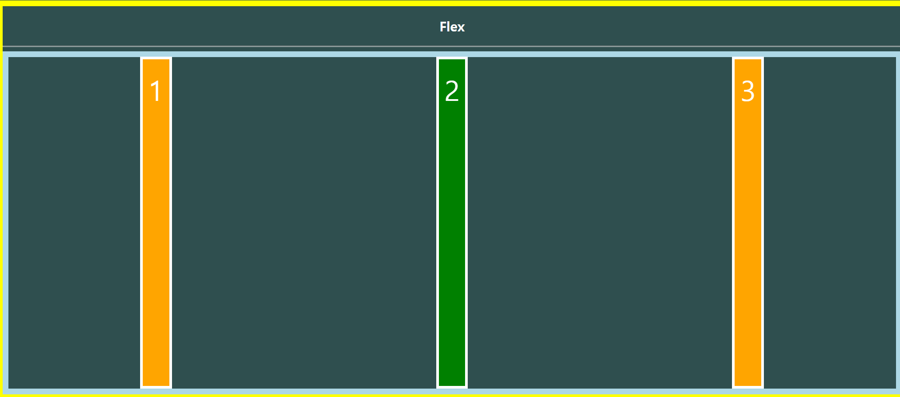

-  `justify-content: space-evenly;`
  - 균등정렬
  - 균등하게 띄워져 있음
  - 내부요소 여백과 외부요소 여백이 같음
  - 여백 1:1:1:1

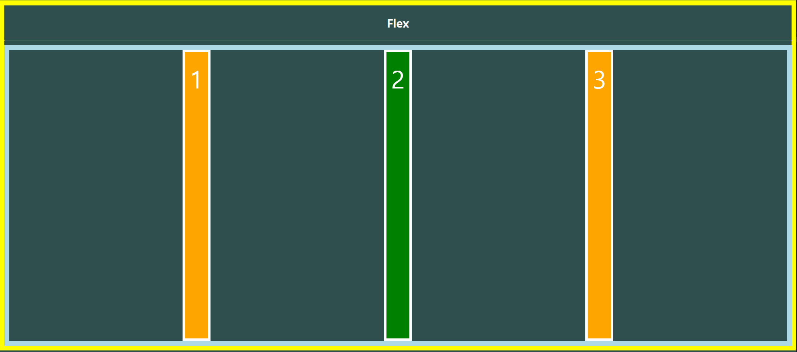


##### 교차축 방향 정렬(align이 붙으면 교차축)

- alilgn-items, align-self, align-content

```html
<style>
/* 크로스축 정렬(현재 y축) */
    /* 원래 div 크기대로 줄어듬 위쪽이 스타트기 때문에 붙어있음*/
    align-items: flex-start;
    /* 크로스축 기준 아래 */
    align-items: flex-end;
    /* 상하기준으로 중간 */
    align-items: center;
    /* 글자들의 크기가 달라져야 바뀜 (baseline 구글 사진 찾기)*/
    align-items: baseline;
</style>
```

- `align-items: flex-start;`
  -  여러 줄들을 컨테이너의 꼭대기에 정렬
  - 원래 div 크기대로 줄어듬 위쪽이 스타트기 때문에 붙어있음

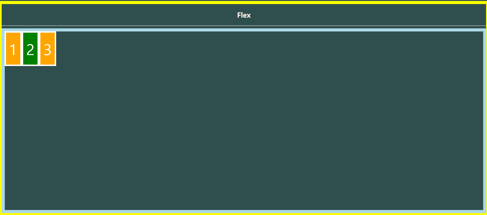

- `align-items: flex-end;`
  - 여러 줄들을 컨테이너의 바닥에 정렬
  - 크로스축 기준 아래


- `align-items: center;`
  - 여러 줄들을 세로선 상의 가운데에 정렬
  - 상하기준으로 중간


- `align-items: baseline;`
  - 글자들의 크기가 달라져야 바뀜 (baseline 구글 사진 찾기)

- `space-between`
  - 여러 줄들 사이에 동일한 간격을 둠
- `space-around`
  - 여러 줄들 주위에 동일한 간격을 둠
- `stretch`
  - 여러 줄들을 컨테이너에 맞도록 늘림

